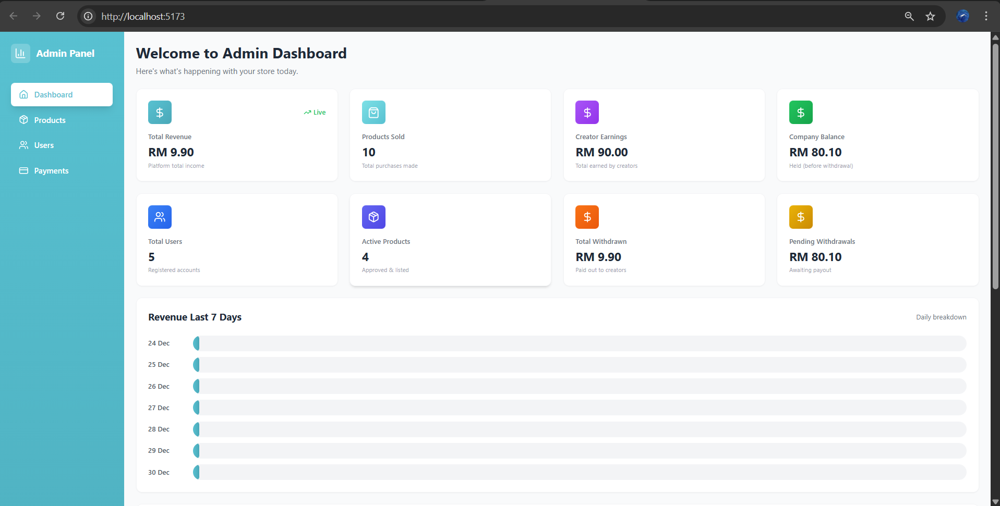
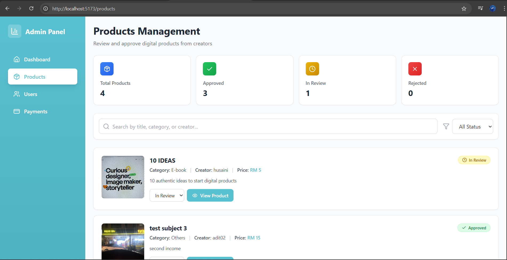
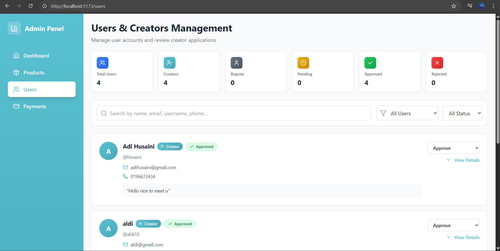

# 🛠 Panen Admin Dashboard

A **React-based admin dashboard** for the **Panen: Digital Product Hub** Flutter app.  
It allows administrators to monitor store performance, manage users and products, and handle withdrawal requests locally. The dashboard connects to a **Supabase database** for real-time data.

---

## 📸 Screenshots

### Dashboard Overview


### Revenue & Products


### Users


### Withdrawals


---

## 🚀 Features

- View **platform metrics**: Total Revenue, Products Sold, Creator Earnings, Company Balance, Total Users, Active Products, Total Withdrawn, Pending Withdrawals  
- **View users** and approve requests to become creators (sell digital products)  
- Approve or reject **active products**  
- Manage and process **creator withdrawals**  
- Real-time updates powered by Supabase  

> ⚠️ This dashboard is designed for **local use only**. There is no login system for admin.

---

## 🧰 Tech Stack

- **Frontend:** React.js, Tailwind CSS / Bootstrap  
- **Database:** Supabase  
- **State Management:** Redux / Context API (if used)  
- **Charts & Visualization:** Recharts / Chart.js  
- **Backend:** Connected to Panen Flutter app APIs  

---

## 🎯 Purpose

Developed as part of my **Final Year Project (FYP)** to manage the Panen digital product hub locally.  
This project demonstrates:  
- Real-time admin monitoring of users, products, and platform metrics  
- Admin approval workflows for creators and product listings  
- Integration with a Flutter app backend and Supabase database  
- Building a clean, responsive React dashboard UI  

---

## ⚙️ Local Setup

```bash
git clone https://github.com/Husaini-husein/panen-admin-dashboard.git
cd panen-admin-dashboard
npm install
npm start
